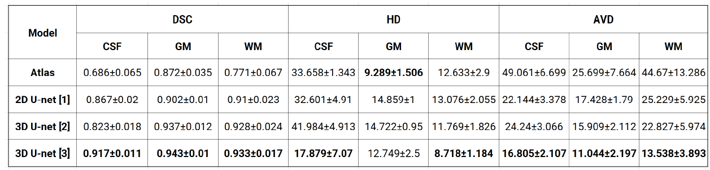

# Tissue-segmentation-Brain-MRI-Images
Segmentation of brain tissues in MRI image has a number of applications in diagnosis, surgical
planning, and treatment of brain abnormalities. However, it is a time-consuming task to be performed
by medical experts. In addition to that, it is challenging due to intensity overlap between the different
tissues caused by the intensity homogeneity and artifacts inherent toMRI. Tominimize this effect, it
was proposed to apply histogram based preprocessing. The goal of this project was to develop a robust
and automatic segmentation of WhiteMatter (WM), GrayMatter (GM)) and Cerebrospinal Fluid
(CSF) of the human brain.

To tackle the problem, we have proposed Convolutional Neural Network (CNN) based approach and
probabilistic Atlas. U-net  is one of the most commonly used and best-performing architecture
in medical image segmentation, and we have used both 2D and 3D versions. The performance was
evaluated using Dice Coefficient (DSC), Hausdorff Distance (HD) and Average Volumetric Difference
(AVD).

## Requirements
### Folder structure
Once the repository has been clone/downloaded, you have to put your dataset in the following way.
```
.
├── datasets
│   ├── Training_Set
│   |── Validation_Set                                                                                                                   
|   |── Testing_Set
├── 2D
├── 3D
```
### Libraries Used
The code has been tested with the following configuration

- h5py == 2.7.0
- keras == 2.0.2
- nibabel == 2.1.0
- nipype == 0.12.1
- python == 2.7.12
- scipy == 0.19.0
- sckit-image == 0.13.0
- sckit-learn == 0.18.1
- tensorflow == 1.0.1
- tensorflow-gpu == 1.0.1

## How to run 
* Run data_handling_2d_patch.py file to create training and validation .npy files (same holds for 3D)
* Run train_main_2d_patch.py to train your CNN.  (same holds for 3D)

## Results


## More detail about the project can be found in report.pdf file.

